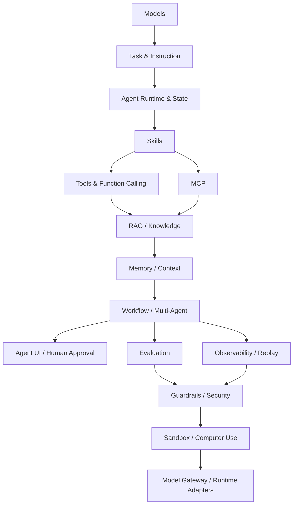

# Agent Engineering Map

## Why this map exists

Agent systems are no longer just chatbots. A useful Agent system usually includes model selection, task design, runtime, tools, skills, memory, RAG, workflow, evaluation, observability, safety, UI, sandboxing and adapter layers.

## Engineering map

## Principle

Each topic should be backed by representative projects, experiments, comparisons, and final best practices.
